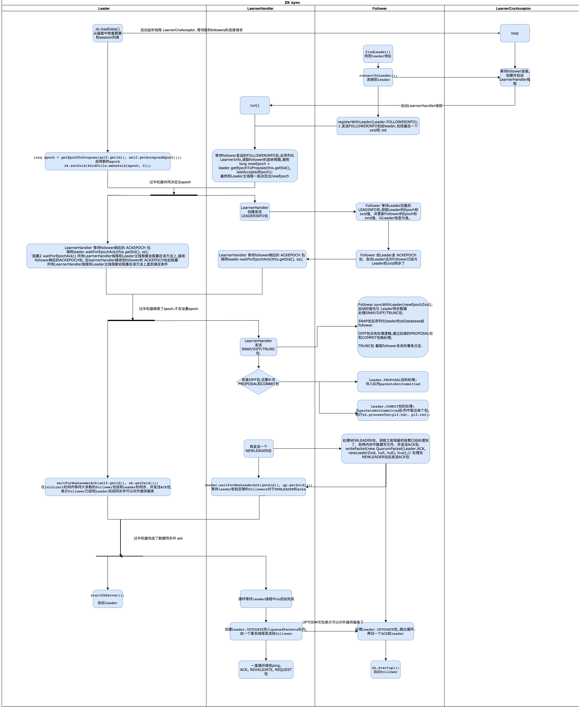

### zk选举完后数据同步流程

Leader为每个Follower/observer都建立一个TCP长连接.

LearnerHandler,即learner服务器的管理者,负责follower/observer服务器和leader服务器之间的一系列网络通信.
包括数据同步,请求转发和Proposal提议的投票等.

leader.lead();
->
leader 从磁盘中恢复数据和session列表
Leader zk.loadData();
->
Leader 启动监听线程 LearnerCnxAcceptor, 等待新的followers的连接请求
->
follower 连接leader
Follower follower.followLeader();
->
LearnerCnxAcceptor 监听到follower的socket请求,为每个 follower 创建单独的 LearnerHandler 线程用于交互.
->
follower 发送 `FOLLOWERINFO` 包 给leader,包括新的zxid​和 sid
Follower registerWithLeader(Leader.FOLLOWERINFO);
->
LearnerHandler 等待接收 follower 发送的 FOLLOWERINFO 包,读取follower的选举周期 epoch,调用leader.getEpochToPropose(),同时Leader也阻塞在这个方法上.直到`过半机器共同决定出epoch`
->
LearnerHandler 创建发送 `LEADERINFO` 包
->
Follower 等待 LEADINFO 包,获取Leader的Epoch和zxid值,并更新Follower的Epoch和zxid值,以Leader信息为准.
->
Follower 给 Leader 发 ACKEPOCH 包,告诉 Leader 这次 Follower 已经与 Leader 的 epoch 同步了.
->
LearnerHandler 等待follower响应的 ACKEPOCH 包.调用leader.waitForEpochAck().
同时Leader也阻塞在这个方法上.直到`过半机器接受了epoch,leader才会设置epoch`
->
LearnerHandler 发送 `SNAP/DIFF/TRUNC` 包,用于follower完成数据同步.
再发送一个 `NEWLEADER` 包
->
Follower 处理SNAP/DIFF/TRUNC包.完成和 leader 的 数据同步.
syncWithLeader()

处理 NEWLEADER 包,说明之前的数据同步包处理完,发送 ACK 包.
writePacket(new QuorumPacket(Leader.ACK, newLeaderZxid, null, null), true);
->
leader 和 learnerHandler 等待在 waitForNewLeaderAck() 上直到`过半机器完成了数据同步并 ack`.
->
leader启动server
startZkServer()
->
LearnerHandler
等待leader server启动完成后,发送一个 UPTODATE 包给 follower
->
Follower
处理 Leader.UPTODATE 包,跳出循环.再回一个 ACK 给 leader,准备结束整个注册过程,然后调 zk.startup() 启动 follower.

### leader发的数据同步包
learnerHandler 线程中会根据 follower 状态选择发不同的数据同步包.

peerLastZxid : follower 最后处理的 zxid

minCommittedLog : leader committedLog 中最小的 zxid

maxCommittedLog : leader committedLog 中最大的 zxid

分四类
- 要是 follower 的最大的 zxid 和 leader 内存中的最大的zxid 相同,发空的 DIFF 包.

- 直接差异化同步 (DIFF同步)
peerLastZxid 介于 minCommittedLog 和 maxCommittedLog 之间

发 DIFF 包,通知 follower 进入 差异化数据同步阶段, leader 即将 把一些 proposal 同步给自己.
针对每个 proposal, leader 会再发 PROPOSAL 包 和 COMMIT 包.

同步完成后,leader 发 NEWLEADER 包, follower 反馈 ACK 表示完成了对 提议缓存队列中 proposal 的同步.

leader 进入 过半策略 等待阶段,等待有过半的 follower 完成了数据同步并 ack.

满足 过半策略 后, leader 向 所有完成数据同步的 follower 发 UPTODATE 包,表示集群已经有过半机器完成了数据同步,能对外提供服务了.

follower 收到 UPTODATE,终止同步流程,ACK 给 leader.

- 先回滚再差异化同步 (TRUNC + DIFF同步)
比如 原 leader B 挂了.501, 502 被绝大部分机器应用了. leader B 要处理 503,写到本地事务日志中,发 proposal 之前挂了.

新一轮选举 A 和 C 选举 产生了 leader A, echo 变更为 6.又提交了601, 602. B此时才再次启动,B 会开始和 leader A 同步数据.

leader A 发现 B 包含一条自己没有的事务记录 503, 则会让 B 进行事务回滚,回滚到 leader A 存在的,且最接近 peerLastZxid 的 ZXID, 即 B 会回滚到 502.

然后再 diff,同步 601 和 602 给 follower.

```
TRUNC 502 (回滚到 502, 则 B 包含了 501, 502,还缺少 601, 602)
PROPOSAL 601
COMMIT 601

PROPOSAL 602
COMMIT 602
```

- 仅回滚同步(TRUNC同步)
peerLastZxid 大于 maxCommittedLog
Leader 让 follower 回滚到 zxid 为 maxCommittedLog 的 事务操作.

- 全量同步(SNAP同步)
peerLastZxid 小于 minCommittedLog
或
leader没有提议缓存队列, peerLastZxid 不等于 lastProcessedZxid(leader恢复数据后得到的最大 zxid)

发 SNAP 包, 然后将leader内存数据库序列化发给 follower,follower应用到内存.


### 同步完成后逻辑
Leader 和 follower都会
设置各自的 processor 链,启动 processor 线程.

Leader
startZkServer()
    -> setupRequestProcessors();// 设置processors链 
    会启动 CommitProcessor 线程, PrepRequestProcessor线程,SyncRequestProcessor线程

Follower
startZkServer()
    -> setupRequestProcessors();// 设置processors链 
    会启动 CommitProcessor 线程, PrepRequestProcessor线程,SyncRequestProcessor线程

self.updateElectionVote(newEpoch);更新选举投票
